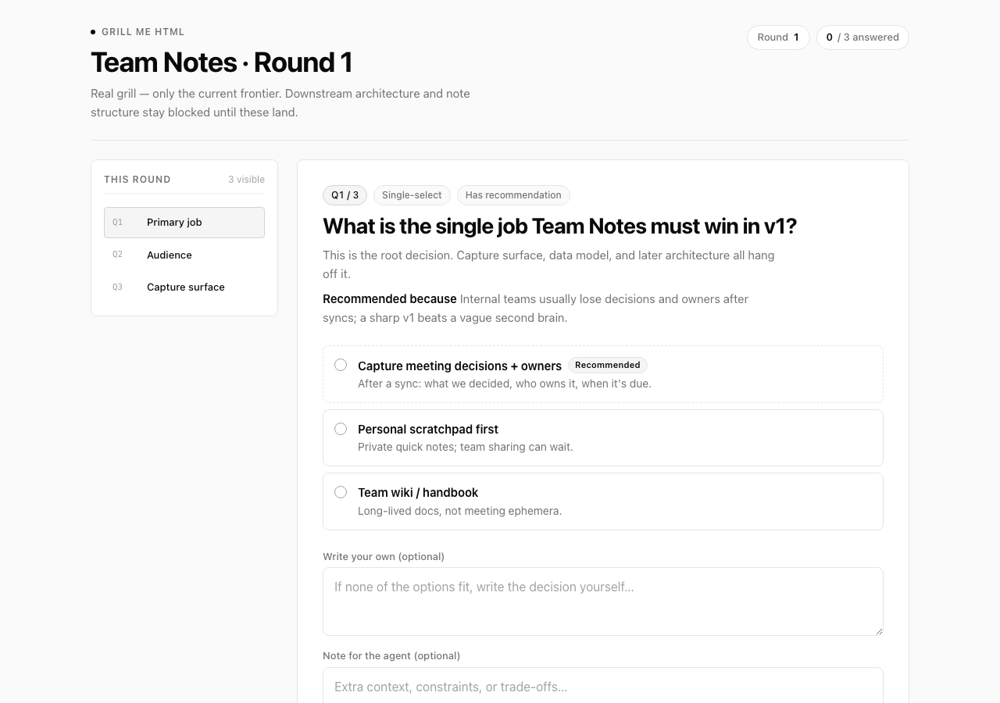
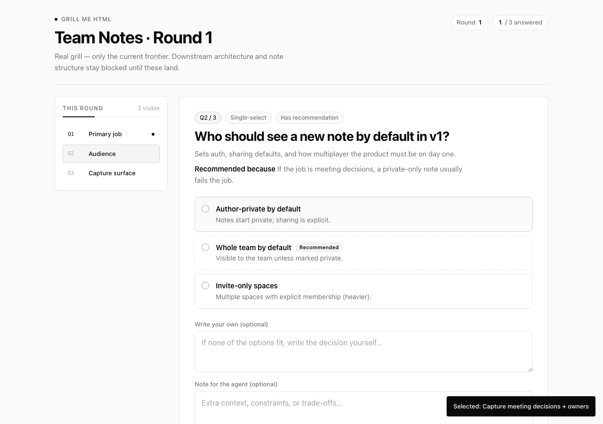
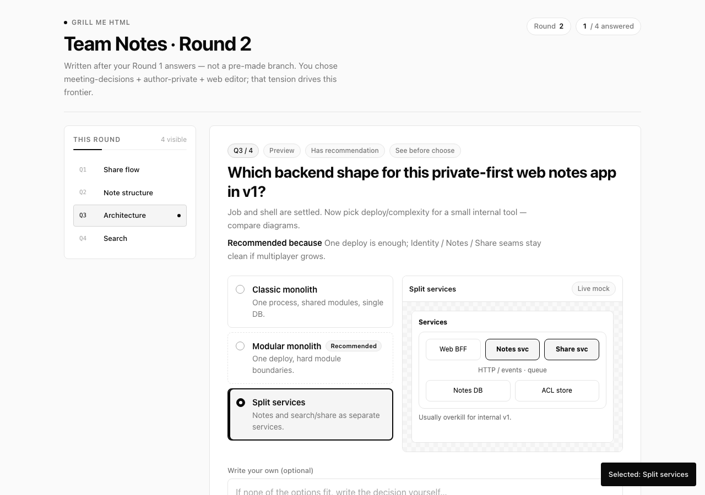
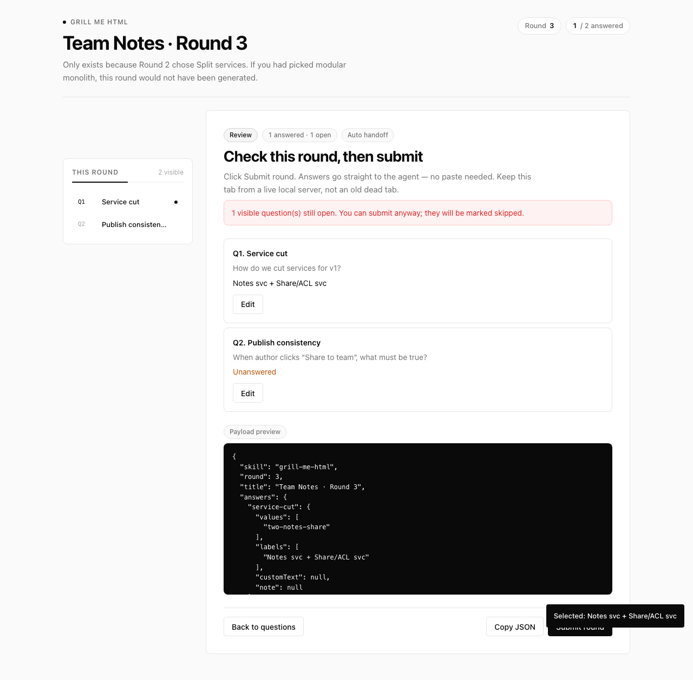
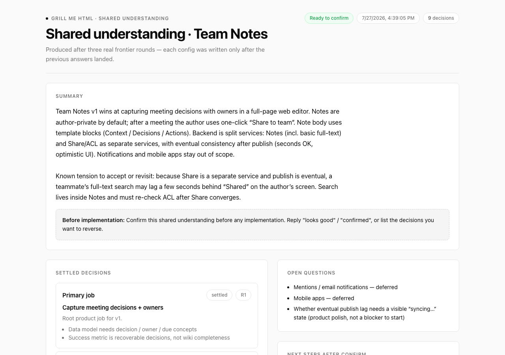

# grill-me-html

Adaptive HTML questionnaires for design interviews.

An agent skill that turns plan/design decisions into browser questionnaires:

- Design tree, asked by **frontier** rounds
- Soft branching inside a round (`visibleWhen`)
- Recommended answers on every question
- **`preview` questions** — option list + live preview pane (text sketches or offline HTML wireframes)
- **Submit round** writes answers locally — no paste by default
- Agent continues after submit via a foreground waiter
- Final **shared-understanding.html** decision page before implementation

## Screenshots

### Question round



### Selected state



### Preview question (architecture diagrams)



### Review + submit



### Shared understanding



## Install

```bash
npx skills add wuyuxiangX/grill-me-html -y
```

Global:

```bash
npx skills add wuyuxiangX/grill-me-html -g -y
```

## Requirements

- Node.js 18+
- A coding agent that can run a long foreground shell command
- Local browser access

## Usage

1. Describe a plan or design.
2. The agent writes `.grill-me-html/config-01.json`.
3. The agent runs (foreground, long timeout):

```bash
node "$SKILL_DIR/scripts/run-round.mjs" \
  --round 1 \
  --config .grill-me-html/config-01.json
```

4. Answer in the browser and click **Submit round**.
5. The process exits `0` and prints `RESULT {...}`.
6. The agent reads `.grill-me-html/answers-01.json` and starts the next round, or finishes with a shared-understanding summary.

Details:

- Auto-continue contract: [`skills/grill-me-html/references/auto-continue.md`](./skills/grill-me-html/references/auto-continue.md)
- Config schema: [`skills/grill-me-html/references/config-schema.md`](./skills/grill-me-html/references/config-schema.md)

## Config example

```json
{
  "skill": "grill-me-html",
  "round": 1,
  "title": "Feature X · Round 1",
  "subtitle": "Upstream product boundaries",
  "questions": [
    {
      "id": "audience",
      "label": "Audience",
      "prompt": "Who is the first user?",
      "type": "single",
      "recommended": {
        "value": "power-users",
        "reason": "Sharper feedback loop for v1."
      },
      "options": [
        { "value": "power-users", "label": "Power users" },
        { "value": "everyone", "label": "Everyone" }
      ]
    },
    {
      "id": "nav-pattern",
      "label": "Navigation",
      "prompt": "Which primary navigation pattern?",
      "type": "preview",
      "recommended": {
        "value": "sidebar",
        "reason": "Better for multi-section tools."
      },
      "options": [
        {
          "value": "sidebar",
          "label": "Left sidebar",
          "description": "Persistent section list + content.",
          "previewFormat": "html",
          "preview": "<div style=\"font:14px system-ui;border:1px solid #e5e5e5;border-radius:8px;display:grid;grid-template-columns:100px 1fr;height:120px\"><aside style=\"background:#f5f5f5;padding:8px\"><strong>App</strong></aside><main style=\"padding:8px\">Content</main></div>"
        },
        {
          "value": "topnav",
          "label": "Top navigation",
          "description": "Horizontal links in the header.",
          "previewFormat": "html",
          "preview": "<div style=\"font:14px system-ui;border:1px solid #e5e5e5;border-radius:8px;height:120px\"><header style=\"padding:8px;border-bottom:1px solid #e5e5e5\"><strong>App</strong> · Home · Docs</header><main style=\"padding:8px\">Content</main></div>"
        }
      ]
    }
  ]
}
```

Use `type: "preview"` when the user should **see** the options (UI layout, IA, architecture). Every option needs non-empty `preview` text; `previewFormat` can be `text`, `html`, or `auto`.

## Layout

```text
grill-me-html/
├── README.md
├── LICENSE
├── docs/media/          # screenshots (preview + summary)
└── skills/grill-me-html/
    ├── SKILL.md
    ├── scripts/
    │   ├── run-round.mjs
    │   ├── serve-and-collect.mjs
    │   └── build-summary.mjs
    ├── templates/
    │   ├── questionnaire.html
    │   └── shared-understanding.html
    └── references/
        ├── auto-continue.md
        └── config-schema.md
```

## Local preview (no agent wait)

Open the built-in demos in a browser:

```bash
open skills/grill-me-html/templates/questionnaire.html
open skills/grill-me-html/templates/shared-understanding.html
```

Or generate a summary page from JSON:

```bash
node skills/grill-me-html/scripts/build-summary.mjs \
  --config path/to/summary.json \
  --out .grill-me-html/shared-understanding.html \
  --open
```

## License

MIT
